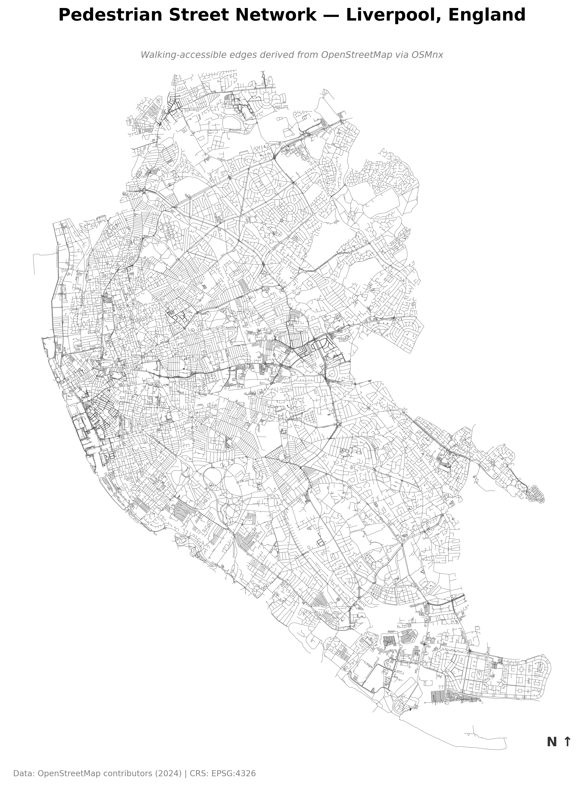
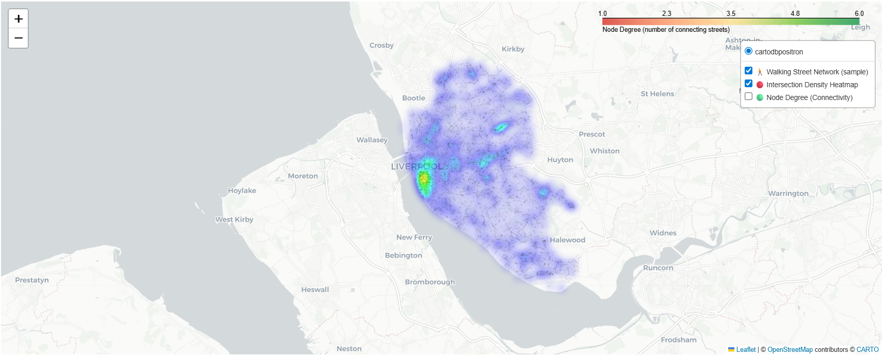

# Liverpool Walkability Analysis

## Overview

This project explores walkability and street network connectivity in Liverpool using Python and geospatial analysis tools. The aim is to understand how the walking network is structured and how spatial data can be used to represent urban accessibility.

The project uses OpenStreetMap data to create and analyse a walking network, then visualises the results through static and interactive maps.

## Tools Used

- Python
- OSMnx
- GeoPandas
- pandas
- Matplotlib
- Folium
- NetworkX
- OpenStreetMap data

## Dataset

The project uses street network data retrieved from OpenStreetMap. The focus is on the walking network in Liverpool, United Kingdom.

The main spatial data includes:

- walking network nodes
- walking network edges
- street connectivity
- node degree values
- Liverpool boundary/location context

## What I Did

- Retrieved Liverpool walking network data using OSMnx
- Created a graph-based street network representation
- Converted network data into geospatial data structures
- Analysed node degree as a measure of connectivity
- Created static maps to visualise the walking network
- Created interactive maps to support exploration of the results
- Interpreted how street connectivity relates to walkability

## Project Outputs

### Static Map: Liverpool Walking Network

This map shows the structure of Liverpool's walking network using OpenStreetMap data. It helps show the density and pattern of walkable streets across the city.

### Static Map: Street Connectivity

This map visualises street connectivity using node degree. Areas with higher node degree have more connected walking routes, while areas with lower node degree have fewer route options.

### Interactive Walkability Map Preview

The interactive map allows users to explore Liverpool's walking network and connectivity patterns in more detail.

## Key Skills Demonstrated

- Geospatial data analysis
- Street network analysis
- OpenStreetMap data retrieval
- Python-based spatial visualisation
- Graph/network thinking
- Static and interactive mapping
- Communicating urban data insights

## Current Status

This repository currently includes the main portfolio notebook for the Liverpool walkability analysis. Output images and README previews will be added next to make the project easier to review without opening the notebook.

## Future Improvements

- Add cleaned portfolio notebook
- Add static map outputs
- Add interactive map preview
- Improve explanation of walkability and connectivity
- Add clearer interpretation of high-connectivity and low-connectivity areas
- Explore additional accessibility indicators in future versions

## References and Data Attribution

- Ewing, R. and Cervero, R. (2017) ‘Does compact development make people drive less? The answer is yes’, *Journal of the American Planning Association*, 83(1), pp. 19–25.
- Frank, L.D., Sallis, J.F., Saelens, B.E., Leary, L., Cain, K., Conway, T.L. and Hess, P.M. (2010) ‘The development of a walkability index: Application to the Neighborhood Quality of Life Study’, *British Journal of Sports Medicine*, 44(13), pp. 924–933.
- Haklay, M. and Weber, P. (2008) ‘OpenStreetMap: User-generated street maps’, *IEEE Pervasive Computing*, 7(4), pp. 12–18.
- Marshall, W.E. and Garrick, N.W. (2010) ‘Street network types and road safety: A study of 24 California cities’, *Urban Design International*, 15(3), pp. 133–147.
- OpenStreetMap contributors (2024) *OpenStreetMap*. Available at: https://www.openstreetmap.org/
- Boeing, G. (2017) ‘OSMnx: New methods for acquiring, constructing, analyzing, and visualizing complex street networks’, *Computers, Environment and Urban Systems*, 65, pp. 126–139.
- Southworth, M. (2005) ‘Designing the walkable city’, *Journal of Urban Planning and Development*, 131(4), pp. 246–257.
- Vale, D.S., Saraiva, M. and Pereira, M. (2016) ‘Active accessibility: A review of operational measures of walking and cycling accessibility’, *Journal of Transport and Land Use*, 9(1), pp. 209–235.
- Cervero, R. and Kockelman, K. (1997) 'Travel demand and the 3Ds: Density, diversity, and design', Transportation Research Part D: Transport and Environment, 2(3), pp. 199–219.
- Shneiderman, B. (1996) 'The eyes have it: A task by data type taxonomy for information visualizations', in Proceedings of the 1996 IEEE Symposium on Visual Languages, pp. 336–343.
